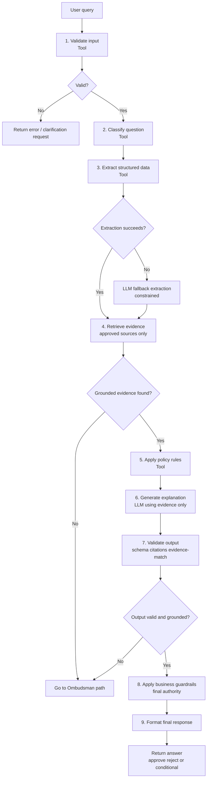
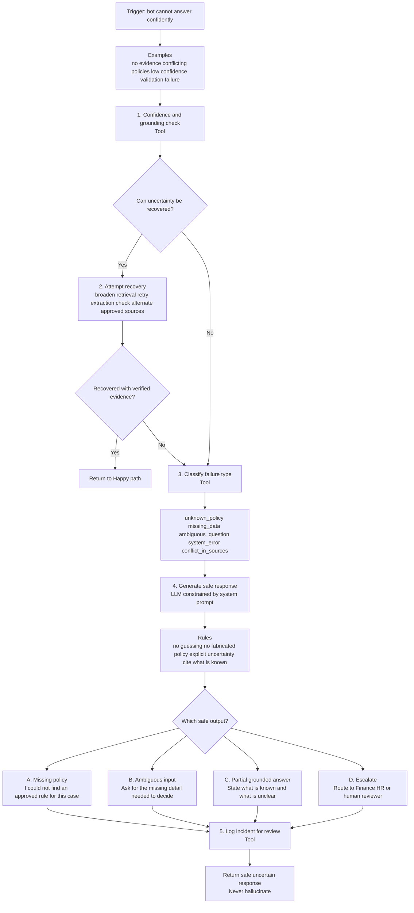

# Bot Logic Flowcharts

This page documents the two decision paths for the bot:

1. **Happy Path** — the standard grounded-answer flow.
2. **Ombudsman Path** — the safety path for unknown, ambiguous, or unsupported cases.

---

## 1) Happy Path

### Purpose

Show how the bot handles a query when it can validate the input, retrieve approved evidence, and return a grounded answer.

### Flow summary

- Validate the request.
- Classify the question type.
- Extract structured facts.
- Retrieve evidence from approved sources.
- Apply policy rules.
- Generate an explanation using only grounded evidence.
- Validate the answer.
- Apply business guardrails.
- Return the final response.

### Mermaid diagram

### Notes

- The **LLM does not make the final decision**.
- The **guardrail engine is the final authority**.
- If evidence is missing or output is not grounded, the flow immediately diverts to the **Ombudsman Path**.

---

## 2) Ombudsman Path

### Purpose

Define what happens when the bot does **not** know the answer with sufficient confidence.

### Trigger conditions

The Ombudsman Path is activated when one or more of the following happen:

- no approved evidence is found
- conflicting policy evidence is retrieved
- extraction confidence is too low
- output validation fails
- required data is missing
- system/tool failure prevents a grounded answer

### Core rule

> **No hallucination allowed.** If the bot cannot support an answer with approved evidence, it must say so clearly and safely.

### Mermaid diagram

### Safe output modes

#### A. Missing policy

Use when there is no approved policy covering the case.

Example:

> I could not find an approved rule that covers this situation.

#### B. Ambiguous input

Use when the user did not provide enough information to decide safely.

Example:

> I need one more detail to answer this correctly: was an external client present?

#### C. Partial grounded answer

Use when some facts are known, but the final decision is not fully supported.

Example:

> I found the meal limit, but I could not verify whether this exception applies to your case.

#### D. Escalation

Use when the question requires human review or policy ownership.

Example:

> This case should be reviewed by Finance because I could not verify a policy exception.

---

## Design principles

### 1. The bot answers only when grounded

A confident answer requires:

- approved source evidence
- policy-consistent reasoning
- successful output validation

### 2. The LLM explains, but does not decide

The LLM is used to produce human-readable language.
It is **not** the source of truth for policy decisions.

### 3. Unknown is an allowed outcome

Saying **"I don’t know based on approved evidence"** is correct behavior.

### 4. Recovery happens before escalation

Before failing safely, the system should try:

- broader retrieval
- alternate approved sources
- constrained extraction fallback

### 5. Every uncertain case should be logged

This improves:

- policy coverage
- retrieval quality
- extraction quality
- future bot performance

---

## One-line takeaway

The bot should answer confidently only when it is grounded in approved evidence; otherwise it must clarify, provide a partial grounded response, or escalate — **never hallucinate**.

flowchart TD
A[User Question] --> B[Validate Input]
B -->|Invalid| X[Return Error]
B -->|Valid| C[Classify Question]
C --> D[Extract Structured Data]
D -->|Fail| D2[LLM Extraction Fallback]
D --> E[Retrieve Evidence]
D2 --> E
E -->|No Results| O[Ombudsman Path]
E --> F[Apply Policy Rules]
F --> G[Generate Explanation (LLM)]
G --> H[Validate Output]
H -->|Fail| O
H --> I[Apply Guardrails]
I --> J[Format Response]
J --> K[Return Answer]
